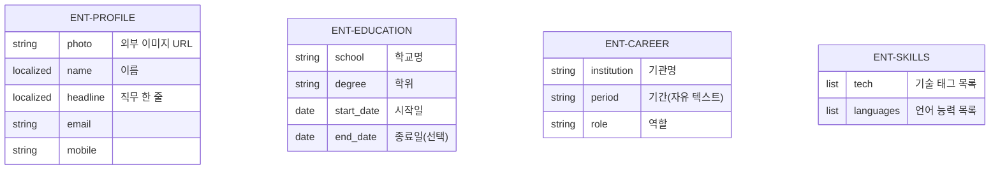

# MyHub 데이터 요구사항 — 논리 데이터 모델

## 0. 문서 정보

### 0.1 목적

이 문서는 PRD 4장(데이터 스키마)과 유저스토리 명세서(`myhub_us.md`)를 바탕으로, 이번 사이클 범위(profile/education/career/skills)의 개체·관계·값 규칙을 확정한다. 이 문서를 읽으면 각 개체가 몇 개 존재하는지, 무슨 조작이 가능한지, 필드별 필수 여부와 검증 규칙이 무엇인지를 확정할 수 있다.

### 0.2 범위

**포함(In scope)**: profile/education/career/skills 4개 개체의 구조, 값 규칙, 필수 여부, 검증, 생애주기(CRUD 가능 범위), 정렬 규칙.

**제외(Out of scope)**: intro/projects/publications/awards(이번 사이클 범위 밖, `myhub_us.md` 0.2 참고), 물리 스키마(실제 DB 컬럼 타입), API 엔드포인트 형식, 화면 배치, 저장소 제품 선정(이미 Supabase PostgreSQL로 확정, 스캐폴드 결정).

### 0.3 독자

- **개발**: 3장(개체별 명세)·4장(관계)을 ORM 모델 구현의 근거로 쓴다.
- **QA**: 6장(검증 규칙 표)을 테스트 케이스로 그대로 옮긴다.
- **기획(소유자 본인)**: 8장(미결 사항)에서 아직 안 정해진 것을 확인한다.

### 0.4 ID 체계

- **데이터 요구사항**: `DRQ-<번호>` — 장 순서대로 001부터 순차 부여 (재사용/재번호 없음, 삭제 시 결번)
- **개체**: `ENT-<이름>` — PRD 데이터 스키마(4장)의 최상위 키 이름을 대문자로 옮김 (예: `education` → `ENT-EDUCATION`)
- **값 개념**: `VAL-<이름>` — 개체 안에 담기는, 스스로 독립적으로 존재하지 않는 값 (예: `VAL-LOCALIZED-TEXT`)

### 0.5 전제 — 바꿀 수 없는 것

- PRD 4장의 데이터 스키마(최상위 키와 필드 구성)는 이번 그릴링에서 변경 대상이 아니다 (`specs/myhub_prd.md` §4).
- 이번 사이클 구현 범위는 profile/education/career/skills로 한정한다 (요구사항 그릴링 합의, `specs/analysis/myhub_us.md`).
- 목록형 개체는 사용자 지정 순서(order) 없이 자동 정렬만 지원한다 (ADR-0001).
- 이 앱은 단일 소유자 시스템이다. 계정/다중 사용자 개념이 없으므로, 모든 개체는 "소유자 참조(owner_id 등)"를 갖지 않는다 — 개체 자체가 곧 유일한 소유자의 데이터다.

---

## 1. 논리 데이터 모델 개요

### 1.1 개체 지도

`ENT-PROFILE`과 `ENT-SKILLS`는 각각 정확히 1개만 존재하는 독립적인 개체이고, `ENT-EDUCATION`과 `ENT-CAREER`는 여러 건이 존재할 수 있는 독립적인 목록이다. 네 개체는 서로 참조나 외래키로 연결되지 않는다 — 한 개체의 데이터가 다른 개체의 필드값을 결정하거나 제한하지 않는다.

> **DRQ-001**: 네 개체는 서로 참조하지 않는 완전히 독립적인 개체다. 한 개체의 삭제·변경 실패가 다른 개체의 조회·저장에 영향을 주지 않는다 (PRD NFR-08).

### 1.2 개체 분류

| 분류 | 개체 | 개수 | 가능한 동작 | 근거 |
|---|---|---|---|---|
| 단일형 (Singleton) | `ENT-PROFILE`, `ENT-SKILLS` | 정확히 1개 | 조회, 수정 (생성·삭제 없음) | PRD DR-03 |
| 목록형 (List) | `ENT-EDUCATION`, `ENT-CAREER` | 0개 이상 | 생성, 조회, 수정, 삭제 | PRD DR-02 |

> **DRQ-002**: 단일형 개체는 애플리케이션 초기화(seed) 시점에 정확히 1건이 미리 만들어지며, 이후 소유자가 그 값을 계속 수정만 한다. 별도의 "생성" 동작은 존재하지 않는다 (`backend/init_db.py`의 seed 로직 참고).
>
> **DRQ-003**: 목록형 개체는 0건인 상태가 정상 상태다. 0건일 때 해당 섹션 전체를 화면에서 숨긴다 (PRD UR-04).

### 1.3 이 모델이 답하지 않는 것

- **소셜 링크(`profile.social[]`)의 독립 식별자**: 목록처럼 보이지만 개별 CRUD 대상이 아니라 `ENT-PROFILE`에 속한 값(`VAL-SOCIAL-LINK`)으로 취급한다. 프로필을 저장할 때 통째로 같이 저장된다 (그릴링 합의, 이유는 3.1 참고).
- **스킬 태그(`skills.tech[]`)의 독립 식별자**: 마찬가지로 개별 항목이 고유 ID를 갖지 않는다. `ENT-SKILLS` 전체가 하나의 값처럼 통째로 교체된다 (그릴링 합의, 3.4 참고).
- **education/career 간 통합 조회**: "전체 이력을 시간순 한 줄로" 보는 통합 뷰는 이 모델의 대상이 아니다. 두 개체는 완전히 독립적이다 (ADR-0002).

---

## 2. 공통 값 규칙

### 2.1 `VAL-LOCALIZED-TEXT` — 다국어 텍스트

한국어/영어가 모두 필요한 필드는 `{ko, en}` 객체로 저장한다. 클라이언트에는 언어 무관하게 전체 객체를 내려보내고, 언어 선택은 클라이언트에서 처리한다 (PRD §4).

> **DRQ-004**: 두 언어 중 한쪽만 입력된 채로 저장할 수 있다. 저장을 막지 않는다 (PRD DR-05).
>
> **DRQ-005**: 렌더링 시 현재 선택된 언어 값이 비어 있으면 다른 언어 값으로 대체(fallback)한다. 둘 다 비어 있으면 2.2(빈 값) 규칙을 따른다.

### 2.2 빈 값

> **DRQ-006**: 목록형 개체가 0건이거나, 단일형 개체의 특정 필드(필수가 아닌 것)가 비어 있으면 해당 섹션/필드 자체를 화면에서 숨긴다. "빈 상자"를 보여주지 않는다 (PRD UR-04).
>
> **DRQ-007**: 필수 필드(3장에 **필수**로 표시된 것)는 비어 있으면 애초에 저장이 거부된다. 저장 이후 시점에 "필수인데 비어 있는" 상태는 존재하지 않는다.

### 2.3 `VAL-DATE` — 날짜

`education`의 `start_date`/`end_date`, `career`의 날짜성 표현에 쓰인다.

> **DRQ-008**: `education.start_date`/`end_date`는 `YYYY-MM-DD` 형식의 실제 날짜값으로 저장하고 서버에서 검증한다. `end_date`가 비어 있으면 "재학 중"으로 간주한다.
>
> **DRQ-009**: `career.period`는 날짜값이 아니라 `VAL-PERIOD-TEXT`(자유 텍스트)로 저장한다. 형식을 검증하지 않는다 (ADR-0003).

### 2.4 고유번호와 표시 순서

> **DRQ-010**: 목록형 개체(`ENT-EDUCATION`, `ENT-CAREER`)의 고유번호는 서버가 저장 시점에 자동으로 부여하며, 소유자가 직접 입력하지 않는다. 항목 삭제 시 번호는 재사용하지 않는다.
>
> **DRQ-011**: 목록형 개체의 표시 순서는 사용자가 지정하지 않고 항상 자동 정렬된다 — `ENT-EDUCATION`은 `start_date` 최신순, `ENT-CAREER`는 저장된 `period` 텍스트 기준 최신순(사전식 정렬이라 항상 정확하지는 않을 수 있음, 8장 참고) (ADR-0001).
>
> **DRQ-012**: 표시 순서는 각 개체 목록 내부에서만 유효하다 — `ENT-EDUCATION`과 `ENT-CAREER`를 하나로 합쳐 정렬하는 기능은 없다 (ADR-0002).

---

## 3. 개체별 명세

[표기: **필수** = 빈 값이면 저장 거부 / **선택** = 빈 값 허용, 빈 값이면 화면에서 사라짐]

### 3.1 `ENT-PROFILE` — 프로필 (단일형, 1개)

| 필드 | 뜻 | 값 종류 | 필수 여부 | 비고 |
|---|---|---|---|---|
| `photo` | 프로필 사진 | 외부 이미지 URL(`VAL-URL`) | 선택 | 업로드 미지원, URL 참조만 (PRD DR-07 v0.4) |
| `name{ko,en}` | 이름 | `VAL-LOCALIZED-TEXT` | **필수** | |
| `nameSuffix{ko,en}` | 이름 뒤 호칭(예: 박사) | `VAL-LOCALIZED-TEXT` | 선택 | |
| `badges[]{ko,en}` | 직무 뱃지(칩) | `VAL-LOCALIZED-TEXT` 배열 | 선택 | 통째 저장(고유 ID 없음) |
| `birth` | 생년월일 | `VAL-DATE` | 선택 | **민감 필드** — 방문자 비공개, 소유자 전용 (PRD UR-13) |
| `address{ko,en}` | 주소(구까지) | `VAL-LOCALIZED-TEXT` | 선택 | **민감 필드** — 방문자 비공개 |
| `militaryService{ko,en}` | 병역 | `VAL-LOCALIZED-TEXT` | 선택 | **민감 필드** — 방문자 비공개 |
| `email` | 이메일 | 문자열 | 선택 | |
| `mobile` | 모바일 번호 | 문자열 | 선택 | |
| `affiliation{ko,en}` | 현재 소속 | `VAL-LOCALIZED-TEXT` | 선택 | |
| `social[]` | 소셜 링크 | `VAL-SOCIAL-LINK` 배열 | 선택 | 통째 저장(고유 ID 없음), `{platform, label, url}` |

> **DRQ-013**: `birth`/`address`/`militaryService` 세 필드는 방문자(`ACT-VISITOR`)에게 응답 자체에서 제외한다 (필드를 비워서 감추는 게 아니라 서버가 응답에 포함하지 않음). 소유자 인증 상태의 조회/편집 응답에만 포함된다 (PRD UR-13, 그릴링 신설).
>
> **DRQ-014**: `social[].url`은 URL 형식을 검증하고, 형식이 아니면 저장을 거부한다 (PRD DR-08).

### 3.2 `ENT-EDUCATION` — 학력 (목록형, 0개 이상)

| 필드 | 뜻 | 값 종류 | 필수 여부 | 비고 |
|---|---|---|---|---|
| `school` | 학교명 | 문자열 | **필수** | |
| `degree` | 학위 | 문자열 | **필수** | |
| `field_of_study` | 전공 | 문자열 | 선택 | PRD 원 스키마의 `major`에 대응 |
| `start_date` | 시작일 | `VAL-DATE` | **필수** | |
| `end_date` | 종료일 | `VAL-DATE` | 선택 | 비어 있으면 "재학 중" |

> **DRQ-015**: `gpa`(평점)는 PRD 원 스키마(4장)에 정의되어 있으나 이번 사이클 스캐폴드 구현에는 아직 없다. 8장 미결 사항 참고.

### 3.3 `ENT-CAREER` — 경력 (목록형, 0개 이상)

| 필드 | 뜻 | 값 종류 | 필수 여부 | 비고 |
|---|---|---|---|---|
| `institution{ko,en}` | 기관명 | `VAL-LOCALIZED-TEXT` | **필수** | |
| `period` | 기간 | `VAL-PERIOD-TEXT`(자유 텍스트) | **필수** | 예: "2025.12 ~ 2026.02" (ADR-0003) |
| `role{ko,en}` | 역할/직무 | `VAL-LOCALIZED-TEXT` | **필수** | |
| `description{ko,en}` | 설명 | `VAL-LOCALIZED-TEXT` | 선택 | |

### 3.4 `ENT-SKILLS` — 스킬 (단일형, 1개)

| 필드 | 뜻 | 값 종류 | 필수 여부 | 비고 |
|---|---|---|---|---|
| `tech[]{ko,en}` | 기술 스킬 태그 목록 | `VAL-LOCALIZED-TEXT` 배열 | 선택 | 통째 저장(고유 ID 없음), 그릴링 합의 |
| `languages[]` | 언어 능력 목록 | `VAL-LANGUAGE-PROFICIENCY` 배열 | 선택 | `{name{ko,en}, level{ko,en}}`, 통째 저장 |

> **DRQ-016**: `ENT-SKILLS`는 저장할 때 항상 `tech[]`와 `languages[]` 전체를 함께 교체한다. 항목 하나만 골라 추가/삭제하는 개별 API는 두지 않는다 (그릴링 합의).

---

## 4. 관계 명세

**존재하지 않는 관계**

- `ENT-PROFILE` ↔ `ENT-EDUCATION`/`ENT-CAREER`/`ENT-SKILLS`: 참조 없음. 모두 단일 소유자의 독립적인 데이터라 "누구의 학력인가"를 표현할 외래키가 필요 없다 (0.5 전제 참고).
- `ENT-EDUCATION` ↔ `ENT-CAREER`: 참조 없음. 통합 조회 기능을 두지 않기로 했다 (ADR-0002).

> **DRQ-017**: 네 개체 모두 서로를 참조하지 않으므로, 한 개체를 삭제(단일형은 해당 없음)해도 다른 개체의 데이터는 영향받지 않는다.

---

## 5. 데이터 요구사항 목록 (DRQ)

### 5.1 구조
- DRQ-001, 002, 003, 017: 개체 독립성과 분류(단일형/목록형) 규칙

### 5.2 값 규칙
- DRQ-004, 005, 006, 009, 010, 011, 012, 013, 016: 다국어 값·빈 값·정렬·민감 필드·통째 저장 규칙

### 5.3 검증
- DRQ-007, 008, 014, 015: 필수 여부, 날짜/URL 형식 검증, 알려진 미완결 필드(gpa)

---

## 6. 검증 규칙 표 (QA용)

| 번호 | 대상 필드 | 입력값 | 기대 결과 |
|---|---|---|---|
| V01 | `profile.name.ko` | 빈 문자열 | 저장 거부 |
| V02 | `profile.social[].url` | `"not-a-url"` | 저장 거부 (DRQ-014) |
| V03 | `profile.birth` | 값 있음, 방문자로 조회 | 응답에 `birth` 필드 자체가 없음 (DRQ-013) |
| V04 | `education.school` | 빈 문자열 | 저장 거부 |
| V05 | `education.end_date` | 비움 | 저장 성공, 화면에 "재학 중" 표시 |
| V06 | `education` 목록 | 2건, 시작일 다름 | 시작일 최신순으로 정렬되어 반환 |
| V07 | `career.institution.ko` | 빈 문자열 | 저장 거부 |
| V08 | `career.period` | `"2022년 여름"` | 저장 성공 (자유 텍스트, DRQ-009) |
| V09 | `education`/`career` 목록 | 0건 | 목록 응답은 빈 배열, 프론트는 섹션 자체를 숨김 |
| ⚠️V10 | `education.gpa` | 값 입력 시도 | ⚠️ 필드 자체가 아직 없음 — OPEN-01 참고 |

---

## 7. 유저스토리 추적표

| 유저스토리 | 관련 DRQ / 절 |
|---|---|
| USG-04-US-001 (프로필 열람) | §3.1, DRQ-006, DRQ-013 |
| USG-04-US-002 (프로필 수정) | §3.1, DRQ-007, DRQ-014 |
| USG-06-US-001~003 (학력 CRUD) | §3.2, DRQ-008, DRQ-011, DRQ-015 |
| USG-07-US-001~002 (경력 CRUD) | §3.3, DRQ-009, DRQ-011 |
| USG-11-US-001~002 (스킬 열람/수정) | §3.4, DRQ-016 |

**이 문서가 뒷받침하지 못하는 유저스토리**

- USG-01(언어 전환), USG-02(테마), USG-03(인쇄), USG-12(탐색), USG-13(인증)은 저장되는 도메인 데이터가 없거나(언어/테마는 `localStorage`, 인증은 세션 쿠키) 이 문서의 개체 모델과 무관하므로 대상이 아니다.

---

## 8. 미결 사항

| ID | 내용 | 그대로 두면 생기는 영향 | 해결 방법 |
|---|---|---|---|
| OPEN-01 | `education.gpa`(평점)가 PRD 원 스키마(4장)에는 있으나 스캐폴드 구현에는 없음 | 평점을 이력서에 표시하고 싶어도 저장할 곳이 없음 | 7장 구현 단계에서 `education` 개체에 선택 필드로 추가 |
| OPEN-02 | `career.period`가 자유 텍스트라 정렬이 사전식이라, 실제 날짜 순서와 어긋나는 표기(예: "2022년 여름" vs "2022.03")가 섞이면 순서가 부정확할 수 있음 | 경력 목록이 의도와 다른 순서로 보일 수 있음 | 소유자가 일관된 표기(YYYY.MM 형식)를 쓰도록 안내 문구 추가 검토, 또는 추후 ADR-0003 재검토 |

---

## 9. 변경 이력

| 버전 | 일자 | 작성자 | 변경 내용 |
|---|---|---|---|
| 0.1.0 | 2026-08-20 | 정현수 | 아키텍처 그릴링(6.3) 결과 최초 작성. 개체 4개(ENT-PROFILE, ENT-EDUCATION, ENT-CAREER, ENT-SKILLS), 값 개념 6개, DRQ 17개, 검증 케이스 10개 정의. 그릴링 합의: (1) education/career 완전 별개 유지(ADR-0002), (2) career.period 자유 텍스트 유지(ADR-0003), (3) skills.tech 통째 저장, (4) social[] 프로필에 통째 포함. 미결 사항 2건(gpa 누락, career 정렬 정확도) 제기 |

---
