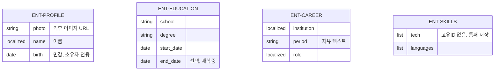

# MyHub 데이터 요구사항 — ER 발췌본

> 이 문서는 `myhub_data_req.md`의 0장(문서 정보), 1장(논리 데이터 모델 개요), 3장(개체별 명세), 4장(관계 명세)만 추출한 컨텍스트 압축본이다. 값 규칙(2장)·검증 표(6장)·추적표(7장)·미결 사항(8장)의 전문은 원본을 참고한다.

## 0. 문서 정보

### 0.4 ID 체계
- **개체**: `ENT-<이름>` / **값 개념**: `VAL-<이름>` / **데이터 요구사항**: `DRQ-<번호>`

### 0.5 전제 — 바꿀 수 없는 것
- PRD 4장의 데이터 스키마는 변경 대상이 아니다.
- 이번 사이클 범위: profile/education/career/skills.
- 목록형 개체는 자동 정렬만 지원, 수동 순서(order) 없음 (ADR-0001).
- 단일 소유자 시스템 — 개체에 owner_id 없음.

---

## 1. 논리 데이터 모델 개요

### 1.1 개체 지도

`ENT-PROFILE`, `ENT-SKILLS`(단일형 1개)와 `ENT-EDUCATION`, `ENT-CAREER`(목록형 0개 이상)는 서로 참조하지 않는 완전히 독립적인 개체다.

### 1.2 개체 분류

| 분류 | 개체 | 개수 | 동작 |
|---|---|---|---|
| 단일형 | `ENT-PROFILE`, `ENT-SKILLS` | 1 | 조회·수정 |
| 목록형 | `ENT-EDUCATION`, `ENT-CAREER` | 0..N | 생성·조회·수정·삭제 |

### 1.3 이 모델이 답하지 않는 것

- `profile.social[]`, `skills.tech[]`는 목록처럼 보이나 고유 ID 없이 부모와 통째로 저장되는 값(`VAL-SOCIAL-LINK`, 태그 목록)이다.
- education ↔ career 통합 조회는 하지 않는다 (ADR-0002).

---

## 3. 개체별 명세

### 3.1 `ENT-PROFILE` (단일형, 1개)
`photo`(URL만) · `name{ko,en}`**필수** · `nameSuffix{ko,en}` · `badges[]` · `birth`**민감** · `address{ko,en}`**민감** · `militaryService{ko,en}`**민감** · `email` · `mobile` · `affiliation{ko,en}` · `social[]{platform,label,url}`(통째 저장)

- 민감 3필드(`birth`/`address`/`militaryService`)는 방문자 응답에서 제외, 소유자에게만 노출.

### 3.2 `ENT-EDUCATION` (목록형, 0개 이상)
`school`**필수** · `degree`**필수** · `field_of_study` · `start_date`**필수** · `end_date`(선택, 비면 재학중)

- `gpa`는 PRD 원 스키마에 있으나 미구현 (OPEN-01).

### 3.3 `ENT-CAREER` (목록형, 0개 이상)
`institution{ko,en}`**필수** · `period`**필수**(자유 텍스트) · `role{ko,en}`**필수** · `description{ko,en}`(선택)

### 3.4 `ENT-SKILLS` (단일형, 1개)
`tech[]{ko,en}`(통째 저장) · `languages[]{name{ko,en},level{ko,en}}`(통째 저장)

---

## 4. 관계 명세

**존재하지 않는 관계**
- `ENT-PROFILE` ↔ 나머지 3개: 참조 없음 (단일 소유자 시스템).
- `ENT-EDUCATION` ↔ `ENT-CAREER`: 참조 없음, 통합 조회 없음 (ADR-0002).

---
