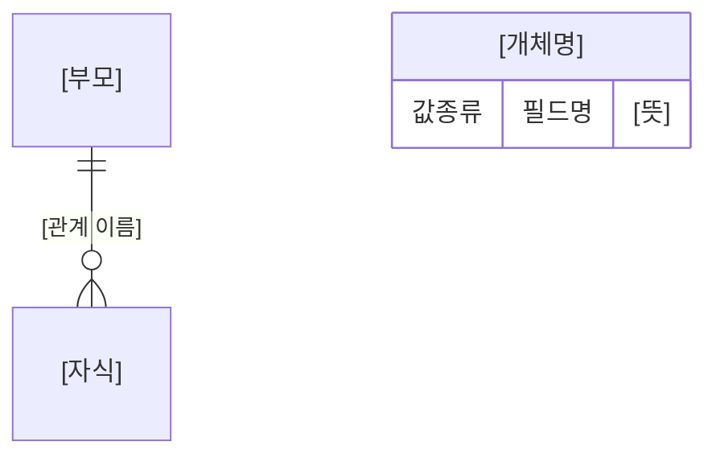

<!--
  데이터 요구사항(논리 데이터 모델) 템플릿
  [ ] 표시는 프로젝트별로 채워야 할 자리입니다.
  ID 접두어(DRQ/ENT/VAL/R/V/OPEN)는 프로젝트 성격에 맞게 바꿔도 됩니다.
  이 템플릿에는 표를 두지 않았습니다. 실제 문서를 쓸 때 각 자리에 표·목록·다이어그램 중 알맞은 형태를 골라 채우세요.
-->

---
doc_id: [PROJECT]-DATAREQ-001
title: [프로젝트명] 데이터 요구사항 — 논리 데이터 모델
version: 0.1.0
status: draft            # draft | review | approved | deprecated
owner: [작성자]
updated: [YYYY-MM-DD]
related_docs:
  - [연관 문서명]: [경로]
---

# [프로젝트명] 데이터 요구사항 — 논리 데이터 모델

## 0. 문서 정보

### 0.1 목적

[이 문서가 정의하는 것과, 상위 문서(PRD/유저스토리)에서 이미 정해진 것의 경계를 2~3문장. "이 문서를 읽으면 무엇을 확정할 수 있는지"로 끝맺는다.]

### 0.2 범위

[포함(In scope): 이 문서가 책임지는 것 — 개체 구조, 관계와 다중도, 공통 값 규칙, 필수 여부와 검증, 생애주기, 전체 데이터 취급 단위 등]

[제외(Out of scope): 명시적으로 다루지 않는 것과 그것이 어디서 다뤄지는지 — 물리 설계, 저장소 제품 선정, API 형식, 화면 배치, 성능 목표 등]

### 0.3 독자

[기획 / 개발 / QA 각각이 이 문서의 어느 장을 어떻게 쓰는지 한 줄씩.]

### 0.4 ID 체계

[이 문서에서 쓰는 ID의 종류·형식·예시·부여 규칙. 최소한 아래 세 가지를 정의한다.]

- **데이터 요구사항**: `DRQ-<번호>` — [주제별 구간 배정 방식]
- **개체**: `ENT-<이름>` — [이름을 어디서 따오는지]
- **값 개념**: `VAL-<이름>` — [스스로 존재하지 못하고 개체에 담기는 값]

[ID 재사용·결번 처리 원칙 한 줄.]

### 0.5 전제 — 바꿀 수 없는 것

[이 문서가 손댈 수 없는 상위 결정과 그 근거 문서. 예: 스키마 고정, 상위 개체 미도입 결정(ADR), 범위 밖 기능. 각 항목에 근거 파일 경로나 ADR 번호를 반드시 단다.]

---

## 1. 논리 데이터 모델 개요

### 1.1 개체 지도

[개체들이 서로 어떻게 연결되는지 한 문단으로 먼저 서술한 뒤 다이어그램을 붙인다. 특히 "연결되지 않는다"는 사실이 있으면 그것부터 밝힌다.]

> **DRQ-[번호]**: [모델 전체에 걸리는 최상위 규칙. 예: 개체 간 독립성, 한 개체의 실패가 다른 개체에 미치는 영향] ([근거])

### 1.2 개체 분류

[개체를 성격별로 나누고, 분류마다 몇 개 존재하는지·어떤 동작이 가능한지·근거가 무엇인지 밝힌다. 예: 단일형(1개, 조회·수정만) / 목록형(0개 이상, 추가·삭제·순서변경) / 부속(부모당 0개 이상, 부모와 함께 변경).]

> **DRQ-[번호]**: [분류별로 반드시 지켜져야 할 규칙] ([근거])

### 1.3 이 모델이 답하지 않는 것

[일부러 만들지 않은 개체·필드를 이유와 함께 나열한다. 나중에 "왜 없지?"라는 질문이 나올 자리를 미리 막는 절이다.]

---

## 2. 공통 값 규칙

<!--
  여러 개체에 반복해서 나타나는 값의 성질을 여기서 한 번만 정의한다.
  개체별 명세(3장)에서 같은 규칙을 되풀이하지 않기 위한 절이다.
-->

### 2.1 `VAL-[값개념명]` — [한글 이름]

[이 값이 무엇인지 한두 문장. 구성·저장 방식·전달 방식·선택 시점을 밝힌다.]

> **DRQ-[번호]**: [이 값의 저장 규칙] ([근거])
>
> **DRQ-[번호]**: [빈 값·경계 상황에서의 규칙] ([근거])

### 2.2 빈 값

> **DRQ-[번호]**: ["값이 없음"의 여러 상태를 구분하는지, 화면에서 어떻게 되는지, 저장 시 어떻게 정리하는지] ([근거])
>
> **DRQ-[번호]**: [개체 전체가 비었을 때의 취급과 예외] ([근거])

### 2.3 `VAL-[값개념명]` — [한글 이름]

[형식 제약이 있는 값(날짜·기간·코드 등)의 허용 모양과 예시. 필드마다 허용 모양이 다르면 그 대응 관계를 밝힌다.]

> **DRQ-[번호]**: [검증 시점과 실패 시 사용자에게 무엇을 알리는지] ([근거])
>
> **DRQ-[번호]**: [이 값으로 하지 않는 것 — 계산·정렬 등] ([근거])

[⚠️ 상위 문서의 형식 규칙으로 표현할 수 없는 실제 사례가 있다면 여기서 경고하고 8장 미결 사항으로 넘긴다.]

### 2.4 고유번호와 표시 순서

> **DRQ-[번호]**: [고유번호를 누가 부여하는지, 사용자에게 노출되는지, 재사용하는지] ([근거])
>
> **DRQ-[번호]**: [나열 차례의 기준과, 기준값이 겹칠 때의 안정 정렬 규칙] ([근거])
>
> **DRQ-[번호]**: [순서가 유효한 범위 — 어느 경계 안에서만 뜻을 갖는지] ([근거])

---

## 3. 개체별 명세

<!--
  개체 하나당 절 하나. 아래 블록을 복사해 사용한다.
  표기 규칙을 절 앞에 한 번 선언하고, 개체마다 반복하지 않는다.
-->

[표기: **필수** = 빈 값이면 저장 거부 / **선택** = 빈 값 허용, 빈 값이면 화면에서 사라짐]

### 3.1 `ENT-[개체명]` — [한글 이름] ([분류], [개수])

[필드마다: 필드명 / 뜻 / 값 종류 / 필수 여부 / 비고(근거·예외·다른 문서의 결정 참조).]

> **DRQ-[번호]**: [이 개체에만 해당하는 규칙. 다른 개체와 다르게 취급되는 이유를 함께 적는다] ([근거])

### 3.2 `ENT-[개체명]` — [한글 이름] ([분류], [개수])

[위와 동일한 구성으로 반복.]

---

## 4. 관계 명세

[관계마다: 관계 ID / 부모 / 자식 / 다중도 / 자식이 홀로 존재할 수 있는지 / 부모가 변할 때 자식은 어떻게 되는지.]

> **DRQ-[번호]**: [관계를 통해 자식을 바꾸는 방식과, 그것이 사용자에게 어떤 경험으로 보이는지] ([근거])

**존재하지 않는 관계**

[만들지 않기로 한 연결과 그 이유를 나열한다. "왜 이 둘은 안 이어져 있지?"라는 후속 질문을 미리 막는다.]

---

## 5. 데이터 요구사항 목록 (DRQ)

<!--
  앞 장에서 인용된 요구사항을 한자리에 모은다. 여기서는 요약만 적고
  자세한 설명은 앞 장을 참조하게 한다. 주제별로 번호 구간을 나눈다.
-->

### 5.1 구조

[개체·관계·분류에 관한 요구사항. ID / 요구사항 한 줄 / 근거.]

### 5.2 값 규칙

[공통 값 개념과 빈 값에 관한 요구사항.]

### 5.3 검증

[필수 여부, 형식 검증, 검증 수행 위치, 실패 시 반환 방식(한꺼번에/부분 저장 금지), 입력값 안전 처리.]

---

## 6. 검증 규칙 표 (QA용)

<!--
  5.3의 규칙을 그대로 테스트할 수 있는 형태로 옮긴다.
  정상 케이스만 나열하지 말고 경계값과 거부 케이스를 반드시 섞는다.
-->

[케이스마다: 번호 / 대상 필드 / 입력값 / 기대 결과. 미결 사항으로 남은 규칙에서 나온 케이스는 ⚠️ 표시와 함께 어느 OPEN 항목인지 적는다.]

---

## 7. 유저스토리 추적표

[유저스토리 ID마다 그것을 뒷받침하는 DRQ 번호와 절 번호를 연결한다.]

**이 문서가 뒷받침하지 못하는 유저스토리**

[저장되는 데이터가 없어 데이터 모델의 대상이 아닌 항목과 그 이유.]

---

## 8. 미결 사항

<!--
  이 문서 범위에서 결정하지 못했거나, 상위 문서를 고쳐야 풀리는 항목.
  상위 문서의 개정이 필요한 건은 그 사실을 분명히 적는다.
-->

[항목마다: ID / 내용 / 그대로 두면 사용자에게 생기는 영향 / 해결 방법과 개정이 필요한 문서.]

---

## 9. 변경 이력

[버전 / 일자 / 작성자 / 변경 내용. 최초 작성 시에는 정의한 개체·관계·요구사항·검증 케이스의 개수와, 제기한 미결 사항을 함께 적는다.]

---
